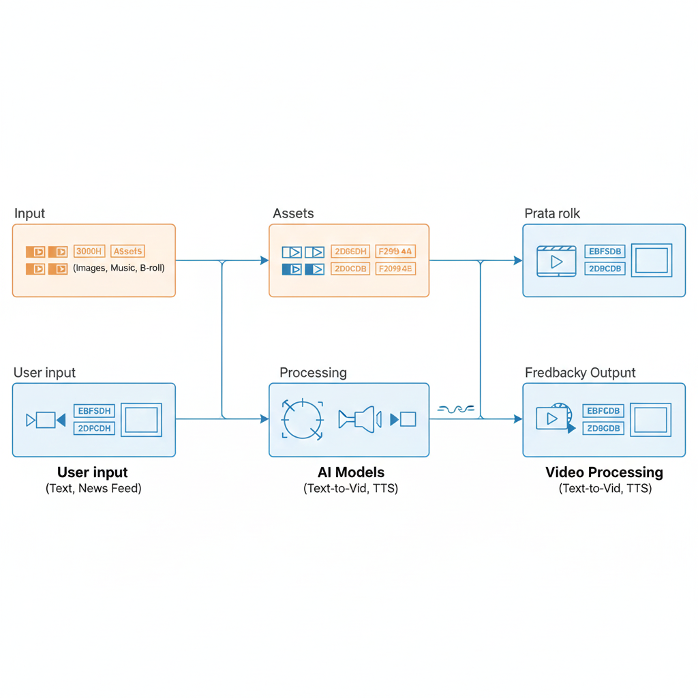

# AI Video Generator

**A small project that converts news or text into short videos using images, text overlays and simple templates.** 🔧🎥🤖

---

## Table of contents

- [About](#about)
- [Features](#features)
- [Project structure](#project-structure)
- [Installation](#installation)
- [Usage](#usage)
- [Images / Gallery](#images--gallery)
- [Contributing](#contributing)
- [License](#license)

---

## About

This repository contains a lightweight Python project that can create short videos from news or input text and images. It includes utilities for assembling images, adding text overlays, and exporting short video clips. Use it as a starting point for automating short video production or for learning how to combine simple image/video processing with templated outputs.

---

## Features ✅

- Compose images and text into short videos
- Template-driven generation
- Simple CLI/script usage
- Example images included in `images/`

---

## Project structure 🔎

- `app.py` — main app entry (run or import)  
- `video_generator.py` — video creation logic  
- `templates/` — HTML templates (if a web UI exists)  
- `images/` — source images used in example runs  
- `generated_videos/` — output videos (ignored in `.gitignore`)  
- `requirements.txt` — Python dependencies  

---

## Installation

1. Create a virtual environment (recommended):

```bash
python -m venv .venv
.\.venv\Scripts\activate
```

2. Install dependencies:

```bash
pip install -r requirements.txt
```

---

## Usage

- Run the main script:

```bash
python app.py
```

- Or call the generator directly from Python:

```python
from video_generator import generate_video
# pass an image list, captions, output path, etc.
```

See the code comments in `video_generator.py` for parameter details and examples.

---

## Images / Gallery 🖼️

The repository includes example images in the `images/` folder. You can preview them in Markdown (on GitHub) or use them as inputs to the generator.

- `AI Video Generator _ News to Video_page-0001.jpg`
- `AI Video Generator _ News to Video_page-0002.jpg`
- `AI Video Generator _ News to Video_page-0003.jpg`
- `AI Video Generator _ News to Video_page-0004.jpg`
- `AI Video Generator _ News to Video_page-0005.jpg`

Preview (GitHub may encode spaces in URLs):


---

## Sample output / Example video ▶️

A sample video generated by this project is included in the `generated_videos/` folder. You can play it on GitHub by following the link, or preview it directly in supporting browsers below.

- `generated_videos/vid_172114.mp4`

Preview (inline):

<video controls src="generated_videos/vid_172114.mp4" width="640">Your browser does not support video playback. Download: [generated_videos/vid_172114.mp4](generated_videos/vid_172114.mp4)</video>

---

## Architecture / Workflow 🏗️

This repository includes a visual workflow diagram that explains how the `AI Video Generator` processes inputs through its components (Input → Assets → Processing → AI model → Output/Storage). The PNG diagram is included in the `images/` folder as `workflow.png`.



---

## Contributing 🤝

Contributions are welcome. Open an issue to discuss features or submit a pull request with clear scope and tests where appropriate.

---

## License

This project is provided under the MIT License — feel free to adapt it for personal or commercial projects.

---

If you want, I can also generate a sample SVG right now using the prompt above and add it to `assets/logo.svg` — say the word and I’ll add it. ✨
